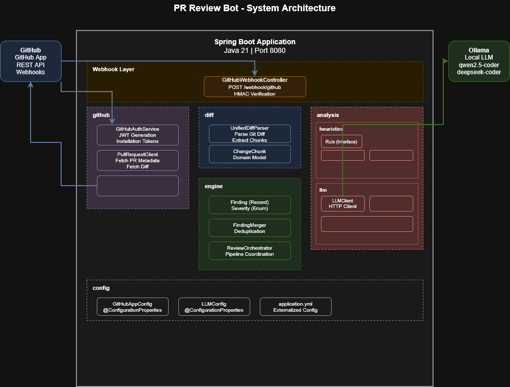

# PR Review Bot

An intelligent, automated code review system that integrates with GitHub to provide real-time feedback on pull requests using static heuristics and local LLM inference.



## Features

- **Automated PR Reviews**: Triggered on PR open, update, or reopen
- **Dual Analysis Engine**: 
  - Fast static heuristics (secrets, null checks)
  - Deep LLM analysis (contextual code review)
- **Local LLM Support**: Privacy-preserving inference using Ollama
- **GitHub Native**: Publishes reviews as GitHub PR comments
- **Extensible**: Easy to add new heuristic rules

## Architecture

The system follows a pipeline architecture:

1. **Webhook Layer**: Receives GitHub events, verifies signatures
2. **GitHub Integration**: Authenticates as GitHub App, fetches PR data
3. **Diff Processing**: Parses unified diff into structured chunks
4. **Analysis Engine**: 
   - Static heuristics (regex-based, fast)
   - LLM review (contextual, thorough)
5. **Finding Merger**: Deduplicates and ranks findings
6. **Review Publisher**: Submits structured review to GitHub

See [Architecture Documentation](docs/Architecture.md) for details.

## Quick Start

### Prerequisites

- Java 21+
- Maven 3.9+
- [Ollama](https://ollama.com) installed
- GitHub App configured

### 1. Install Ollama & Model

```bash
# Install Ollama
curl -fsSL https://ollama.com/install.sh | sh

# Pull code review model
ollama pull qwen2.5-coder:7b

# Start server
ollama serve
```

### 2. Configure GitHub App

Create GitHub App at Settings > Developer settings > GitHub Apps with the following configuration:

- **Pull requests**: Read & Write
- **Contents**: Read
- **Events**: Subscribe to Pull request events
- Download private key to `certs/github-app.pem`
- Note your App ID and Webhook Secret

### 3. Configure Application

```bash
cp .env.example .env
# Edit .env with your GitHub App credentials
```

### 4. Run

```bash
./mvnw spring-boot:run
```

### 5. Expose Webhook (Local Development)

```bash
ngrok http 8080
# Update GitHub App webhook URL to https://xxx.ngrok.io/webhook/github
```

## Configuration

| Variable | Description | Default |
|----------|-------------|---------|
| `GITHUB_APP_ID` | GitHub App ID | - |
| `GITHUB_CLIENT_ID` | GitHub App Client ID | - |
| `GITHUB_WEBHOOK_SECRET` | Webhook signature secret | - |
| `LLM_MODEL` | Ollama model name | qwen2.5-coder |
| `LLM_BASE_URL` | Ollama API URL | http://localhost:11434 |

See Configuration Guide for all options.

## API Documentation

### Webhook Endpoint

**POST** `/webhook/github`

Receives GitHub webhook events. Verifies HMAC-SHA256 signature.

**Headers:**
- `X-GitHub-Event`: Event type (pull_request)
- `X-Hub-Signature-256`: Signature
- `X-GitHub-Delivery`: UUID

**Response:** 200 OK (async processing)

## Development

### Project Structure

```
pr-review-bot/
├── config/          # Configuration classes
├── webhook/         # Webhook controller
├── github/          # GitHub API clients
├── diff/            # Diff parsing
├── analysis/        # Analysis engines
│   ├── heuristics/  # Static rules
│   └── llm/         # LLM integration
├── engine/          # Core engine
└── docs/            # Documentation
```

### Adding a New Rule

```java
@Component
public class MyCustomRule implements Rule {
    @Override
    public List<Finding> analyze(ChangeChunk chunk) {
        List<Finding> findings = new ArrayList<>();
        // Your analysis logic
        return findings;
    }
    
    @Override
    public String getName() {
        return "MyCustomRule";
    }
}
```

## Deployment

See [Deployment Guide](docs/Deployment.md) for:

- Docker deployment
- Kubernetes manifests
- Production considerations
- Monitoring setup

## Troubleshooting

See Troubleshooting Guide for common issues.

## Contributing

1. Fork the repository
2. Create feature branch (`git checkout -b feature/amazing-feature`)
3. Commit changes (`git commit -m 'Add amazing feature'`)
4. Push to branch (`git push origin feature/amazing-feature`)
5. Open Pull Request

## License

MIT License - see LICENSE file.
